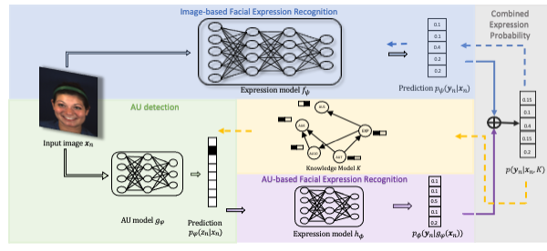

# Knowledge augmented deep models for joint facial expression and action units recogtion
> To appear in NeurIPS 2020



## Dependencies

Tensorflow


## Datasets
* BP4D (<http://www.cs.binghamton.edu/~lijun/Research/3DFE/3DFE_Analysis.html>)
* CK+ (http://www.jeffcohn.net/Resources/)
* MMI (https://mmifacedb.eu/)
* EmotioNet (http://cbcsl.ece.ohio-state.edu/EmotionNetChallenge/index.html)

## Hyper-parameter Setting
```sh
learning rate r=0.0005
\gamma = 0.001
\lambda_1 = 0.005; \lambda_2 = 0.001
Maximun number of epoch = 100
```

## To run the code
```sh
python main_ThreeModel_Training.py
```


