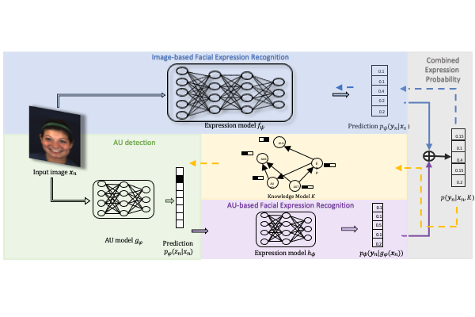

# Knowledge Augmented Deep Neural Networks for Joint Facial Expression and Action Units Recognition
> Zijun Cui, Tengfei Song, Yuru Wang, Qiang Ji (NeurIPS 2020)



## Dependencies

Tensorflow


## Datasets
* BP4D (<http://www.cs.binghamton.edu/~lijun/Research/3DFE/3DFE_Analysis.html>)
* CK+ (http://www.jeffcohn.net/Resources/)
* MMI (https://mmifacedb.eu/)
* EmotioNet (http://cbcsl.ece.ohio-state.edu/EmotionNetChallenge/index.html)

## Hyper-parameter Setting
```sh
learning rate r=0.0005
γ = 0.001
λ_1 = 0.005
λ_2 = 0.001
Maximun number of epoch = 100
```

## To run the code
```sh
python main_ThreeModel_Training.py
```

## Contact
cuiz3@rpi.edu 


